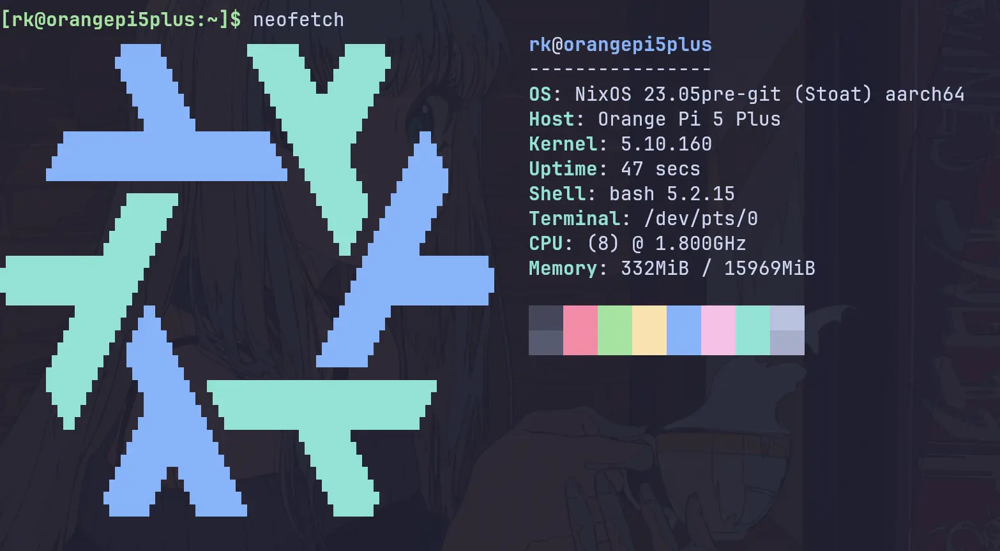
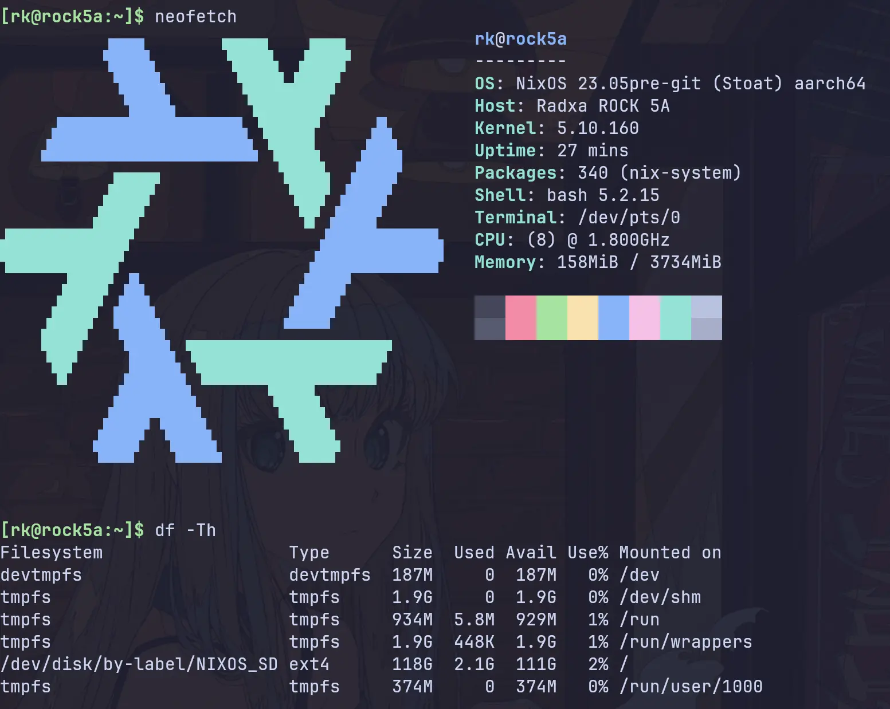

# NixOS running on RK3588/RK3588s

> :warning: Work in progress, use at your own risk...

A minimal flake to run NixOS on RK3588/RK3588s based SBCs, support both UEFI & U-Boot.

Since this flake was started, some boards (Pi 5, Pi 5 Plus) got upstream Nixpkgs support.
The upstream support does not cover all boards yet,
  and has some differences with vendor-provided kernel (for example, different NPU interfaces).
The flake still exists to provide system configs and SD card images based on vendor kernel and U-Boot,
  since some may prefer them over upstream at the moment.

If you want to make an SD card image for your board using upstream packages (without using this flake),
  see [this example config](./examples/upstream-opi/) for Pi 5 Plus.
If the example config works for you, you don't need this flake.

## Boards

UEFI support:

| Singal Board Computer | Boot from SD card  | Boot from SSD      |
| --------------------- | ------------------ | ------------------ |
| Orange Pi 5           | :heavy_check_mark: | :heavy_check_mark: |
| Orange Pi 5 Plus      | :heavy_check_mark: | :heavy_check_mark: |
| Rock 5A               | :no_entry_sign:    | :no_entry_sign:    |

U-Boot support:

| Singal Board Computer | Boot from SD card  | Boot from SSD      |
| --------------------- | ------------------ | ------------------ |
| Orange Pi 5           | :heavy_check_mark: | :heavy_check_mark: |
| Orange Pi 5 Plus      | :heavy_check_mark: | :heavy_check_mark: |
| Rock 5A               | :heavy_check_mark: | :no_entry_sign:    |

### FriendlyELEC UEFI images

CM3588 NAS, NanoPC-T6, NanoPC-T6 LTS, NanoPi R6C and NanoPi R6S use the Armbian vendor
kernel and board-specific vendor DTBs. Module evaluation has passed.
Hardware boot and peripherals remain untested. Proprietary GPU userspace is
disabled by default. The CM3588 vendor DTB disables the PWM fan, so check
cooling before use.

| Board | Core module under `nixosModules.boards` | Image package |
| --- | --- | --- |
| CM3588 NAS | `cm3588-nas.core` | `rawEfiImage-cm3588-nas` |
| NanoPC-T6 | `nanopc-t6.core` | `rawEfiImage-nanopc-t6` |
| NanoPC-T6 LTS | `nanopc-t6-lts.core` | `rawEfiImage-nanopc-t6-lts` |
| NanoPi R6C | `nanopi-r6c.core` | `rawEfiImage-nanopi-r6c` |
| NanoPi R6S | `nanopi-r6s.core` | `rawEfiImage-nanopi-r6s` |

Build with `nix build .#rawEfiImage-cm3588-nas` on an AArch64 builder or with
emulation. The configuration is `nixosConfigurations.cm3588-nas-uefi`;
the other boards use the same `-uefi` suffix.

These raw disk images contain no firmware. Install compatible board-specific
UEFI firmware first. Locate it before writing the OS image. A whole-disk write
to the same SD/eMMC device can overwrite the firmware. Use separate OS media
or preserve the firmware's reserved area and partition layout during installation.
Separate experimental `sdImage-<board>` packages include U-Boot and use extlinux.
See [FriendlyELEC U-Boot images](./U-Boot.md#friendlyelec-sd-images).
The UEFI outputs and core-module defaults are unchanged.

Use Linux Device Tree mode with Vendor compatibility. Record the firmware
version and settings. Check the
[EDK2 guidance on external DTBs and firmware fixups](https://github.com/edk2-porting/edk2-rk3588#device-tree-configuration).

The images use systemd-boot with a processed DTB for each generation.
The core modules do not install a shared `/boot/dtb` override.
Images keep two boot-menu generations by default. Check free space on the
approximately 249 MiB ESP before updates, especially with custom initrds.

For a custom host, import its core module and provide
`specialArgs.rk3588.pkgsKernel` as an AArch64 package set.
Configure systemd-boot and filesystems yourself.
Change the demo account credentials listed below before connecting to a network.

#### NanoPi R6C validation status

The R6C uses RK3588S and `rockchip/rk3588s-nanopi-r6c.dtb`.
Its DTS inherits the R6S and common R6 descriptions, then changes the board
identity, GPIO-header names, user LED, PWM0/PWM1 m2 pins and second PCIe lane
for M.2. The kernel patch removes an inherited R6S-only NIC node after Armbian
renamed it. Keep these overrides when updating the DTS.
[Pinned R6C DTS](https://github.com/armbian/linux-rockchip/blob/b908c7339f51eddcfe8402cd15d1e1f8f4e67c29/arch/arm64/boot/dts/rockchip/rk3588s-nanopi-r6c.dts)

Use R6C-specific EDK2 firmware with Device Tree / Vendor compatibility.
Record its version, storage location and override settings.
Check the boot entry and active DTB on both current and rollback generations.
Record any firmware DTB override settings.
The vendor model is `FriendlyElec NanoPi R6C`, with compatibles
`friendlyelec,nanopi-r6c` and `rockchip,rk3588`.
[EDK2 firmware guidance](https://github.com/edk2-porting/edk2-rk3588#readme)

DT-only compilation and structural checks have passed. Hardware remains untested.
The module selects UART2 FIQ console `ttyFIQ0` at 1500000 baud.
Check serial recovery with cold-boot logs and `/proc/consoles`.
Test SD/eMMC, NVMe, USB, GPIO/LED/PWM, GPU/media workloads, and booting
the current and rollback generations.

Test both Ethernet ports for firmware loading, driver binding, MAC addresses,
DHCP, link speed and sustained traffic. The in-tree `r8169` supports RTL8125A/B
and requests `rtl_nic/rtl8125a-3.fw` or `rtl_nic/rtl8125b-2.fw`.
The base module enables redistributable firmware. No external `r8125` module
is included. Check whether the installed NIC revision needs it.
[Pinned r8169 driver](https://github.com/armbian/linux-rockchip/blob/b908c7339f51eddcfe8402cd15d1e1f8f4e67c29/drivers/net/ethernet/realtek/r8169_main.c)

#### NanoPi R6S validation status

Build with `nix build .#rawEfiImage-nanopi-r6s`. The configuration is
`nixosConfigurations.nanopi-r6s-uefi`. It uses the unchanged vendor kernel and
`rockchip/rk3588s-nanopi-r6s.dtb`, with model `FriendlyElec NanoPi R6S` and
compatibles `friendlyelec,nanopi-r6s` and `rockchip,rk3588`.
The built DTB retains GMAC1 and both PCIe Ethernet endpoints, `r8125_u25` and
`r8125_u40`. The console is `ttyFIQ0` at 1500000 baud, as on R6C.
[Pinned R6S DTS](https://github.com/armbian/linux-rockchip/blob/b908c7339f51eddcfe8402cd15d1e1f8f4e67c29/arch/arm64/boot/dts/rockchip/rk3588s-nanopi-r6s.dts)

Use R6S-specific EDK2 firmware in Device Tree / Vendor mode. Locate its storage
before writing the raw OS image, and preserve the firmware layout or use separate
OS media. systemd-boot installs the processed DTB per generation. Record firmware
DT override settings and check the selected boot entry and actual DTB on current
and rollback generations.
[EDK2 firmware and DT guidance](https://github.com/edk2-porting/edk2-rk3588#readme)

Image evaluation and built-DTB checks pass. Hardware boot testing remains pending.
Before deployment, check serial recovery, all three Ethernet ports, firmware
loading, MAC addresses, negotiated links and sustained traffic. Test storage,
USB, LEDs and current and rollback boot generations on the board.

## TODO

- [ ] UEFI support for Rock 5A, Rock 5B, Orange Pi 5B.
- [ ] Complete NanoPi R6S hardware validation listed above.
- [ ] Complete NanoPi R6C hardware validation listed above.
- [ ] verify all the hardware features available by RK3588/RK3588s
  - [x] ethernet (rj45)
  - [x] m.2 interface(pcie & sata)
  - [x] wifi/bluetooth
  - [x] audio
  - [x] gpio
  - [x] uart/ttl
  - [x] gpu(mali-g610-firmware + panthor)
  - [x] npu (works with [rkllama](https://github.com/NotPunchnox/rkllama), tested on OPi 5 Plus)
  - ...

## Flash & Boot NixOS

Default user: `rk`, default password: `rk3588`

Firmware requirements depend on the image. FriendlyELEC `sdImage-*` packages
include U-Boot; their `rawEfiImage-*` counterparts need separately installed UEFI.
Check the board-specific instructions below before changing existing firmware.

This flake supports UEFI and U-Boot, here are the install steps:

- [UEFI.md](./UEFI.md)
- [U-Boot.md](./U-Boot.md)

I personally recommend running U-Boot, as our support for UEFI has known bugs (https://github.com/gnull/nixos-rk3588/issues/1).

Feel free to drop a testing report in the associated [discussions page](https://github.com/gnull/nixos-rk3588/discussions/2).

## Optional vendor Mali OpenCL

Mali G610 OpenCL is disabled by default. For headless use and tone-mapping, see
[setup and compatibility requirements](./examples/mali-opencl/README.md).

## Debug via serial port(UART)

See [Debug.md](./Debug.md)

## Custom Deployment

You can use this flake as an input to build your own configuration.
Here is an example configuration that you can use as a starting point: [Demo - Deployment](./examples/demo).

The demo above uses Colmena with remote deployments.
If you want something more basic, just create a [regular system config with flakes](https://nixos-and-flakes.thiscute.world/nixos-with-flakes/nixos-with-flakes-enabled)
  and import `nixos-rk3588.nixosModules.${board}` as well as `nixos-rk3588.nixosModules.${board}.sd-image`
  modules provided by this flake.

## How this flake works

A complete Linux system typically consists of five components:

1. Bootloader (typically U-Boot or EDKII)
1. Linux kernel
1. Device trees
1. Firmwares
1. Root file system (rootfs)

Among these, the bootloader, the kernel, device trees, and firmwares are hardware-related and require customization for different SBCs.
On the other hand, the majority of content in the rootfs is hardware-independent and can be shared across different SBCs.

Hence, the fundamental approach here is to **use the hardware-specific components(bootloader, kernel, and device trees, firmwares) provided by the vendor(orangepi/rockpi/...), and combine them with the NixOS rootfs to build a comprehensive system**.

Regarding RK3588/RK3588s, a significant amount of work has been done by Armbian on their kernel, and device tree.
Therefore, by integrating these components from Armbian with the NixOS rootfs, we can create a complete NixOS system.

The primary steps involved are:

1. Bootloader: Since no customization is required for U-Boot or [edk2-rk3588], it's also possible to directly use the precompiled image from [armbian], [edk2-rk3588], or the hardware vendor.
2. Build the NixOS rootfs using this flake, leveraging the kernel and device tree provided by [armbian].
   - To make all the hardware features available, we need to add its firmwares to the rootfs. Since there is no customization required for the firmwares too, we can directly use the precompiled firmwares from Armbian & Vendor too.

## Screenshots

## References

- [K900/nix](https://gitlab.com/K900/nix)
- [aciceri/rock5b-nixos](https://github.com/aciceri/rock5b-nixos)
- [nabam/nixos-rockchip](https://github.com/nabam/nixos-rockchip)
- [fb87/nixos-orangepi-5x](https://github.com/fb87/nixos-orangepi-5x)
- [dvdjv/socle](https://github.com/dvdjv/socle)
- [edk2-rk3588]

And I also got a lot of help in the [NixOS on ARM Matrix group](https://matrix.to/#/#nixos-on-arm:nixos.org)!

[edk2-rk3588]: https://github.com/edk2-porting/edk2-rk3588
[armbian]: https://github.com/armbian/build
