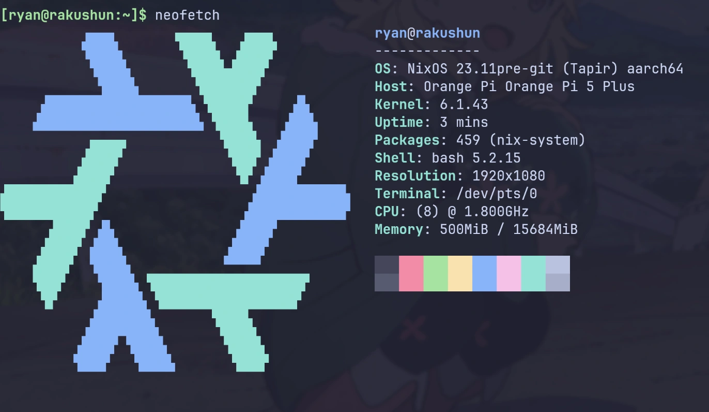
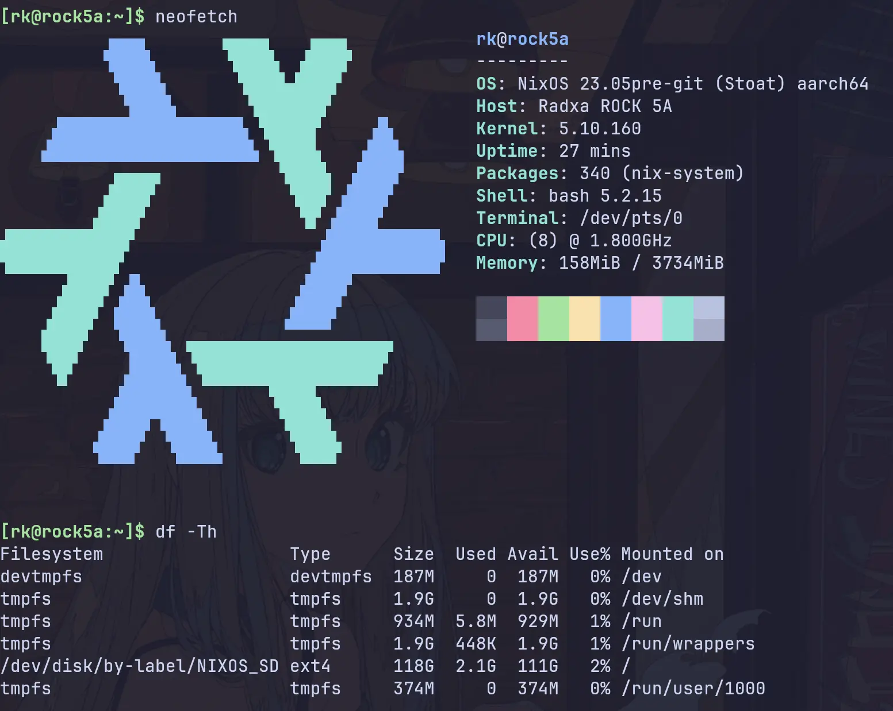

# NixOS running on RK3588/RK3588s

> :warning: Work in progress, use at your own risk...

A minimal flake to run NixOS on RK3588/RK3588s based SBCs, support both UEFI & U-Boot.

Default user: `rk`, default password: `rk3588`

## Boards

UEFI support:

| Singal Board Computer | Boot from SD card  | Boot from SSD      |
| --------------------- | ------------------ | ------------------ |
| Orange Pi 5           | :heavy_check_mark: | :heavy_check_mark: |
| Orange Pi 5 Plus      | :heavy_check_mark: | :heavy_check_mark: |
| Rock 5A               | :no_entry_sign:    | :no_entry_sign:    |

U-Boot support:

| Singal Board Computer | Boot from SD card  | Boot from SSD      |
| --------------------- | ------------------ | ------------------ |
| Orange Pi 5           | :heavy_check_mark: | :heavy_check_mark: |
| Orange Pi 5 Plus      | :heavy_check_mark: | :no_entry_sign:    |
| Rock 5A               | :heavy_check_mark: | :no_entry_sign:    |

## TODO

- [ ] verify all the hardware features available by RK3588/RK3588s
  - [x] ethernet (rj45)
  - [ ] wifi/bluetooth
  - [ ] audio
  - [x] gpio
  - [x] uart/ttl
  - [ ] gpu(mali-g610-firmware + [panfork/mesa](https://gitlab.com/panfork/mesa))
  - [ ] npu
  - ...

## Flash & Boot NixOS

For UEFI, see [UEFI.md](./UEFI.md).

For U-Boot, see [U-Boot.md](./U-Boot.md).

## Debug via serial port(UART)

See [Debug.md](./Debug.md)

## Custom Deployment

You can use this flake as an input to build your own configuration.
Here is an example configuration that you can use as a starting point: [Demo - Deployment](./demo)

## How this flake works

A complete Linux system typically consists of five components:

1. Bootloader (typically U-Boot or EDKII)
1. Linux kernel
1. Device trees
1. Firmwares
1. Root file system (rootfs)

Among these, the bootloader, the kernel, device trees, and firmwares are hardware-related and require customization for different SBCs.
On the other hand, the majority of content in the rootfs is hardware-independent and can be shared across different SBCs.

Hence, the fundamental approach here is to **use the hardware-specific components(bootloader, kernel, and device trees, firmwares) provided by the vendor(orangepi/rockpi/...), and combine them with the NixOS rootfs to build a comprehensive system**.

Regarding RK3588/RK3588s, a significant amount of work has been done by Armbian on their kernel, and device tree.
Therefore, by integrating these components from Armbian with the NixOS rootfs, we can create a complete NixOS system.

The primary steps involved are:

1. Bootloader: Since no customization is required for U-Boot or [edk2-rk3588], it's also possible to directly use the precompiled image from [armbian], [edk2-rk3588], or the hardware vendor.
2. Build the NixOS rootfs using this flake, leveraging the kernel and device tree provided by [armbian].
   - To make all the hardware features available, we need to add its firmwares to the rootfs. Since there is no customization required for the firmwares too, we can directly use the precompiled firmwares from Armbian & Vendor too.

## References

- [K900/nix](https://gitlab.com/K900/nix)
- [aciceri/rock5b-nixos](https://github.com/aciceri/rock5b-nixos)
- [nabam/nixos-rockchip](https://github.com/nabam/nixos-rockchip)
- [fb87/nixos-orangepi-5x](https://github.com/fb87/nixos-orangepi-5x)
- [edk2-rk3588]

And I also got a lot of help in the [NixOS on ARM Matrix group](https://matrix.to/#/#nixos-on-arm:nixos.org)!

[edk2-rk3588]: https://github.com/edk2-porting/edk2-rk3588
[armbian]: https://github.com/armbian/build
